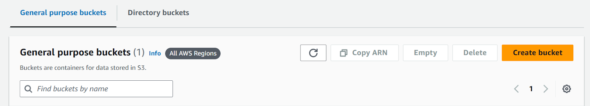

Config_Frontend
===============

.. _frontend_deploy:

Frontend Deployment
--------------------

The restaurant app is deployed on AWS services using S3 Bucket, CloudFront, and Route 53. Below are the step-by-step instructions for deployment:

Create and Configure S3 Bucket
----------------------------------

**Create an S3 Bucket**:

1. Go to the AWS Management Console.

2. Navigate to the S3 service.

3. Click on **Create bucket**.

4. Give your bucket a name (e.g., `my-restaurant-app-static`) and select a region.

5. Configure bucket settings as needed.

6. Upload Build Files

- After the bucket is created, go inside the bucket in the AWS Management Console.

- Upload the build files and folders of the project. To build the project, run the following command:

   .. code-block:: console

      $ npm run build

- Once the build process is complete, upload the contents of the `build` directory to the S3 bucket.

7. Configure Static Website Hosting

- Go to the **Properties** section of the S3 bucket.

- Click the **Edit** button in the **Static website hosting** section.

- Enable the **Static website hosting** setting.

- Configure the index document (e.g., `index.html`) and error document (e.g., `error.html`) as needed.

 - **Save the changes**.

.. image:: images/image2.png
   :alt: Description of the image
   :width: 800px
   :height: 700px
   :align: center

**Set Up CloudFront Distribution And Configure Route 53 for DNS Management**:

